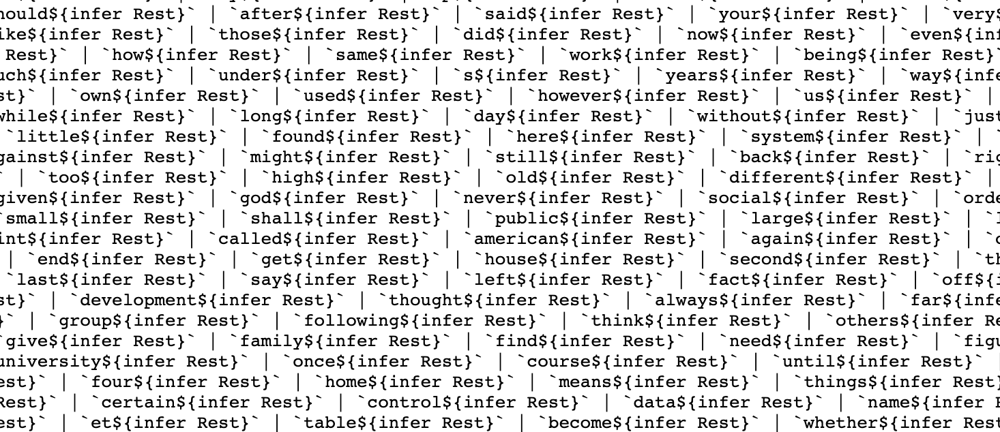

# Type-checker Spell-checker

## Wut

This is a typescript spell checker. I'm sorry, I misspoke: this is a compile-time spell checker using only typescript's type checker. No, I'm serious. Well, I mean, obviously not _that_ serious, but it _does_ work.

```typescript
import { ValidWords } from "./spellcheck";

// Typechecks cleanly:
const result: ValidWords<"the quick brown fox."> = "valid";

// Throws a type error
const result: ValidWords<"the qxick brown fox."> = "valid";
```

<p align="center">
  
</p>

## Let me see that...

If you don't believe such evil could exist in the world, try it yourself. Edit demo.ts to replace the test string with your own, run `yarn install`, then run `yarn run tsc --noEmit demo.ts`.

You'll either get this if the test string is spelled correctly:

```shell
$ yarn run tsc --noEmit demo.ts
yarn run v1.22.4
$ /Users/kevin/code/js/typescript/spellcheck/node_modules/.bin/tsc --noEmit demo.ts
✨  Done in 50.32s.
```

Or this if it's not:

```shell
$ yarn run tsc --noEmit demo.ts
yarn run v1.22.4
$ /Users/kevin/code/js/typescript/spellcheck/node_modules/.bin/tsc --noEmit demo.ts
demo.ts:7:7 - error TS2322: Type '"valid"' is not assignable to type '"invalid"'.

7 const result: ValidWords<"the qxick brown fox jumped over the lazy dog."> =
        ~~~~~~


Found 1 error.

error Command failed with exit code 2.
info Visit https://yarnpkg.com/en/docs/cli/run for documentation about this command.
```

## How does this work?

Poorly.

Ok, here's a simplified version that only supports two valid words: "cat" and "dog" and a space character as the only non-letter character allowed. If this makes sense to you, that makes one of us (and you can probably skip the rest of this section).

```typescript
type ValidWords<T extends string> = T extends ""
  ? "valid"
  : T extends `cat${infer Rest}` | `dog${infer Rest}`
  ? ValidJoiner<Rest>
  : "invalid";

type ValidJoiner<T extends string> = T extends ""
  ? "valid"
  : T extends ` ${infer Rest}`
  ? (ValidWords<Rest> | ValidJoiner<Rest>)
  : "invalid"

// Will cause a type error if the string is not composed of valid words.
const result:ValidWords<'cat dog dog cat'> = 'valid';
```

There are a few things you need to know to get this:

1. [String literals can act as types](https://www.typescriptlang.org/play?ts=4.1.0-dev.20200915#code/C4TwDgpgBAyg9gWwgFXNAvFA5AMznAIwEMAnLAKHIHoqoA1IgGwEsATcgYzgDsBnYKL0QQGJAIwAuWMNSQomXPmJkA3JRpQAktwBuTNpx79Bw0QCYp8JLIzYCzAF7EHWFUA). `type SomeType = 'foobar'` is a valid type: it'll only allow values that are strings equal to 'foobar'.
2. Typescript has type conditionals: `type SomeType = (condition) ? string : number`, so SomeType will be the string type if condition is true and the number type if it's false.
3. The only condition you can actually put in there is `type1 extends type2`, which tells you if type1 is a subtype of type2.

So you can use type conditionals to test for stuff using a generic:

```typescript
type SomeType<SomeGeneric> = SomeGeneric extends string
  ? "yepyepyep"
  : "nopenopenope";

// Will be string literal type 'yepyepyep'
type ResultType1 = SomeType<string>;

// Will be string literal type 'nopenopenope'
type ResultType2 = SomeType<void>;
```

Finally, typescript allows some fancy type shenanigans (to use the technical type-theory terminology) using the `infer` keyword in template strings. Use `` SomeGeneric extends `foo${infer Rest}` ? ... : ... `` [as a type conditional](https://www.typescriptlang.org/play?ts=4.1.0-dev.20200915#code/C4TwDgpgBAyg9gWwgFXBAPPJBxCA7CAJwEsBjAPigF5ZEJcCTSoIAPYfAEwGcoADAGZw4AEgDexPAKJQAShG7AAvnygB+foQXAq4+YpVQAXFABEnYpzwByYFAQBDYKQAWUIXFMAoLwHpfcgpwADYAbgpQwHCRLtCKJHgA5lDBxByEDsGRaFDWWopUHtZeoJCB3ACuwcCokACM1LRItRimHgBGDoSm5D7+5SHhvFExccAJyanpmdll5pY2do7Obh7epdD6VTVoAEyNWCho6KbtxABenec9QA) and it'll evaluate the true branch only if SomeGeneric is a string literal type that starts with the string 'foo'.

As a quick break, here's a picture of my dog.

<p align="center">
  
</p>

Oh, and finally-finally, because typescript was designed by the Norse god of mischief, types can be recursive. If you want to make a type that's a repeatedly-nested array of numbers (because you were poorly-brought-up), try:

```typescript
type SomeType = [number, SomeType | [number]];
const x: SomeType = [1, [2, [3]]]; // type checks cleanly
```

So, back to English. Let's say a valid English sentence is a bunch of valid words like 'cat' and 'dog' and 'falafel' strung together by connectors like spaces and periods. Let's also ignore the wailing and gnashing of teeth sure to be coming from any English teacher reading this paragraph.

Now, assuming there are are only two words, 'dog' and 'cat (and I can't really imagine why you'd need any other words), we can define a sentence in pseudocode like:

valid_sentence = ('dog' or 'cat') + ' ' + (valid_sencence or nothing).

So given that, the sentence `dog cat cat` is valid becuase it matches `('dog' or 'cat') + ' ' + ('dog' or 'cat') + ' ' + ('dog' or 'cat') + nothing`

And if we're willing to abandon all good sense and decorum, we can encode that in types as:

```typescript
type ValidWords<T extends string> =
  T extends "" // If the string is empty, we've processed the whole thing already...
  ? "valid"    // ...therefore it must be valid

  // Otherwise, if the string starts with a valid word and a space,
  : T extends `cat ${infer Rest}` | `dog ${infer Rest}`

    // then check if the rest of the sentence is valid
    ? ValidWords<Rest>

    // or if it doesn't start with a valid word, error out
    : "invalid";
```

This doesn't _quite_ work, since it requires the sentence to end in a space. Also, it assumes spaces are the only non-letter characters. Let's change things up a bit such that a sentence just bounces back and forth between valid words and "joiners" like spaces or periods:

```typescript
type ValidWords<T extends string> = T extends ""
  ? "valid"
  : T extends `cat${infer Rest}` | `dog${infer Rest}`
  ? ValidJoiner<Rest>
  : "invalid";

type ValidJoiner<T extends string> = T extends ""
  ? "valid"
  : T extends ` ${infer Rest}` | `.${infer Rest}`
  ? (ValidWords<Rest> | ValidJoiner<Rest>)
  : "invalid"

// Should error out if the type of x doesn't resolve to the string literal type "valid"
const x: ValidWords<"dog cat dog."> = "valid"
```

It works! Well, it does what we want, anyway – it's certainly the ugliest and least-complete spellchecker ever made. From here, we can expand it by taking in a dictionary of words (say, the 100k most common ones) and generating something like:

```typescript
T extends `the${infer Rest}` | `of${infer Rest}` | `and${infer Rest}` | `to${infer Rest}` | `in${infer Rest}` | `a${infer Rest}` | `is${infer Rest}` | `that${infer Rest}` | `for${infer Rest}` | `it${infer Rest}` | `as${infer Rest}` | `was${infer Rest}` | `with${infer Rest}` | `be${infer Rest}` ... and so on for 100k more.
```

That's what we're using in the first code example (and in demo.ts):

```typescript
// Generated beforehand from a dictionary of about 100k words
import { ValidWords } from "./spellcheck";

// Fails to type check if the string contains a mispelled word.
const result: ValidWords<"the quick brown fox jumped over the lazy dog."> =
  "valid";
```

## Ok, so how does the code here work?

Again: poorly.

The script `generate_spellcheck.ts` reads in a dictionary of words (`common_words.txt`) and generates a single massive TS type in [spellcheck.ts](https://github.com/kkuchta/TSpell/blob/master/spellcheck.ts) (`yarn run ts-node generate_spellcheck.ts`). You can then use that to spellcheck something by importing the massive, generated type. See or edit `demo.ts` to try it out, then run the type checker with `yarn run tsc --noEmit demo.ts`. If it runs cleanly, you spelled your sentence correctly.



**Note**: This only works in the as-yet-unofficial TypeScript 4.1 and later. You can play around with that typescript in [TypeScript Playground](https://www.typescriptlang.org/play?ts=4.1.0-pr-40336-88#code/C4TwDgpgBAaghgGwJYBMDqB7ATigzgHgBUoIAPYCAOzyl2CyUoHMA+KAXimLIutygBEAgFBQoAfkEA3RKhFiAXFxLkqNAAYBjOMAAkAb0YAzCFigAlCHQC+6qAB8o6lBiYHjpi1eC3RE2LIoAFIYjKb4lnQsfkoCjDLIKAIA3MLCoJABiSFhWEQqvDR0DMxsnNyqfILy-gIJcjHKPGr8du6UJmaRPnaO6gB07Z1eNup+kgAU8ImYOATdbI7TqDmU4QsAlI1xlPVJaZoYlHRQpErL6Nh4+AIuTFDawFB3-QJl0oECQA) if you want, or `yarn install` should do it in this repo.

## FAQ

**Why would you do this?** I wouldn't.

**No, I mean, why did you build this** To see if I could.

**Ok, it turns out you _can_, but what about _should_?** Oh, absolutely not. This is terribly inefficient. Spell/Type-checking a 9-word sentence takes 40 seconds on my machine and larger dictionaries cause the TS compiler to think it's hit an infinite recursive loop and barf.

**I kinda want to use this for real...** Please don't. Or do, and tell me how it turns out. If you actually want compile-time spell checking for some reason, maybe rig up a step in your JS build pipeline instead of trying to abuse the type checker like some kinda maniac.

**Who's responsible for this monstrosity?** Direct your hate mail to [@kkuchta](https://twitter.com/kkuchta), although a [tweet by @danvdk](https://twitter.com/danvdk/status/1301707026507198464) showed me it was possible.

**\*whispers\*** What?

**\*whispers again\*** Speak up, I can't hear you.

**I said... _hushed voice_ I kinda like code monstrosities like this, where can I find more?** You were right to whisper, you should be ashamed of yourself.

**Don't you code-shame me.** Ok, fine, you might like [css-only async chat](https://github.com/kkuchta/css-only-chat), [lambda-only url shortener](https://github.com/kkuchta/url_shortener), [disguising ruby as JS](https://kevinkuchta.com/2017/07/disguising-ruby-as-javascript/), or [a database in your browser tabs](https://github.com/kkuchta/tabdb).

**Why do you write FAQs for these projects as dialogs instead of prose like a normal person?** Oh look, the README's about to end, no time to answ-
